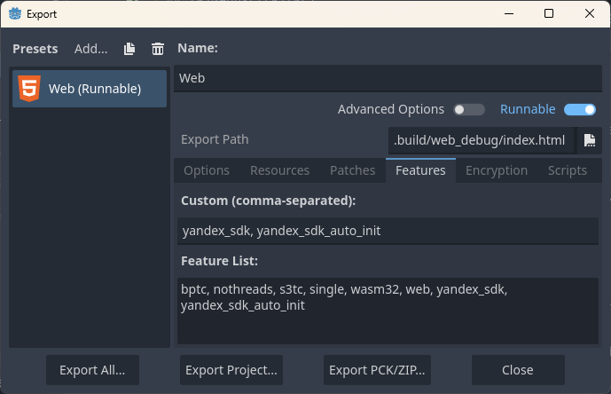

# Yandex Games SDK for Godot 4.4+

[RU](./README.md) | **EN**


## Description

This plugin provides integration of the Yandex Games SDK with the Godot 4.4+ game engine, allowing developers to use Yandex Games platform features such as authentication, data saving, purchases, advertising, and more.

## Installation

Download the latest release of the plugin.  
Place the `addons/yandex_games_sdk` folder in your Godot project directory.  
Enable the `YandexGamesSDK` plugin in `Project Settings → Plugins`.

In Web export, add the following to `Features`:

* `yandex_sdk` - to enable Yandex Games SDK in the project;
* `yandex_sdk_auto_init` - to enable automatic initialization of all modules at game startup.



## Modules

* `YandexSDK` - The Main Class for Integrating Yandex Games Features;
* `YandexSDK.adv` - A Module for Managing Ads in Yandex Games;
* `YandexSDK.device_info` - A Module for Retrieving Device Information in Yandex Games;
* `YandexSDK.feedback` - A Module for Managing Game Ratings and Reviews;
* `YandexSDK.fullscreen` - A Module for Managing Fullscreen Browser Mode;
* `YandexSDK.games` - A Module for Managing Links to Other Games;
* `YandexSDK.leaderboard` - A Module for Managing Leaderboards in Yandex Games;
* `YandexSDK.payments` - A Module for Managing In-Game Purchases;
* `YandexSDK.player` - A Module for Managing Player Data and Game State;
* `YandexSDK.shortcut` - A Module for Adding Game Shortcuts to the Desktop.

## Usage

Interaction with the plugin occurs through the global variable `YandexSDK`.  
Below are commonly used methods.

### Initialization

First, initialize the modules if the `yandex_sdk_auto_init` feature was not set:

```gdscript
await YandexSDK.init()
await YandexSDK.player.init()
await YandexSDK.leaderboard.init()
await YandexSDK.payments.init()
```

### Banner Ads

```gdscript
# Показать баннер
await YandexSDK.adv.show_banner()
# Скрыть баннер
await YandexSDK.adv.hide_banner()
```

### Fullscreen Ads

```gdscript
YandexSDK.adv.show_fullscreen()
```

### Rewarded Ads

```gdscript
func _ready() -> void:
  YandexSDK.adv.show_rewarded_video_rewarded.connect(_on_adv_show_rewarded_video_rewarded)
  YandexSDK.adv.show_rewarded_video()

func _on_adv_show_rewarded_video_rewarded() -> void:
  # User watched the ad and can receive a reward
  pass
```

### User Data

First, fetch data from the Yandex server, update it, and send it back to the Yandex server.  
`YandexSDK.player.set_data` overwrites all data on the Yandex server.

```gdscript
var data = await YandexSDK.player.get_data()
data["info"] = {
  "level": 1,
  "xp": 100,
}
await YandexSDK.player.set_data(data)
```

Data can be any `Dictionary` up to `200 KB` in size.

### Numeric User Data

Similar to `get_data`/`set_data`, fetch data from the Yandex server, update it, and send it back to the Yandex server.

```gdscript
var data = await YandexSDK.player.get_stats()
data["coins"] = 1000
await YandexSDK.player.set_stats(data)
```

Alternatively, modify the data by the specified values.

```gdscript
var data = {
  "coins": 1,
}
await YandexSDK.player.increment_stats(data)
```

Data can be a flat `Dictionary` with numerical values, up to `10 KB` in size.

### Leaderboards

Save player scores to a leaderboard.

```gdscript
var leaderboard_name:String = "main"
var score:int = 100
await YandexSDK.leaderboard.set_score(leaderboard_name, score)
```

## Demo Scene

By downloading the entire project, you can test functions in an interactive scene.  
The completed project can be found in the releases section.

Additional information can be found here:
[https://yandex.com/dev/games/doc/en/concepts/local-launch](https://yandex.com/dev/games/doc/en/concepts/local-launch)

If `@yandex-games/sdk-dev-proxy` is not installed, install it via `npm`.

```bash
npm install -g @yandex-games/sdk-dev-proxy
```

Run the terminal in the game folder and execute the command, replacing `<app-id>` with your application's ID in Yandex Games.

```bash
npx @yandex-games/sdk-dev-proxy -p . --app-id=<app-id> -c
```

After launching, visit the second link to check the application's functionality.

```bash
Server is running on https://localhost:8080/
You can open your game with https://yandex.ru/games/app/<app-id>/?draft=true&game_url=https://localhost:8080
```


## Compatibility

* Godot 4.4+;
* Supports browser-based games on the Yandex Games platform..

## License

This plugin is distributed under the MIT license.
