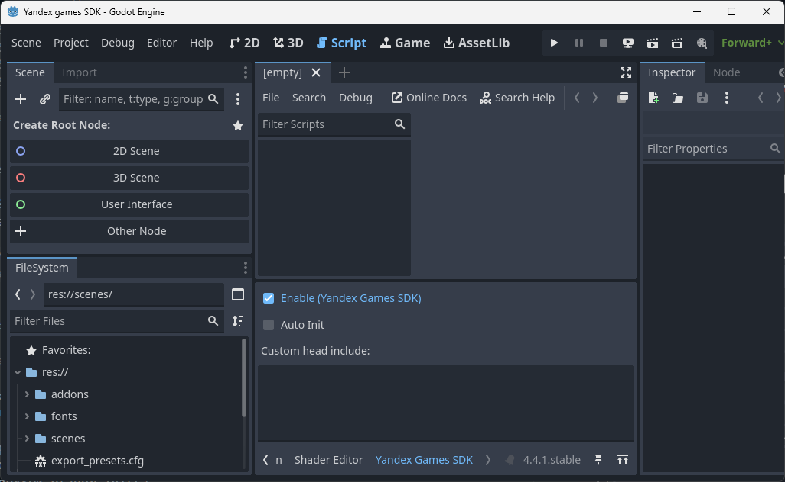

# Yandex Games SDK для Godot 4.4+

**RU** | [EN](./README.EN.md)


## :memo:️ Дисклеймер

> [!NOTE]
> Этот **неофициальный** проект Godot плагина на основе [`Yandex Games SDK`](https://yandex.ru/dev/games/doc/ru/sdk/sdk-about "Yandex Games SDK").  
> Все упоминаемые торговые марки, названия сервисов и логотипы принадлежат их законным правообладателям.  
> Больше информации: [`https://yandex.ru/dev/games/doc/ru/concepts/quick-start`](https://yandex.ru/dev/games/doc/ru/concepts/quick-start "Yandex Games SDK")

## Описание

Этот плагин предоставляет интеграцию Yandex Games SDK с игровым движком Godot 4.4+, позволяя разработчикам использовать функции платформы Яндекс Игр, такие как авторизация, сохранение данных, покупки, реклама и многое другое.

## Установка

Скачайте последний релиз плагина - [archive](https://github.com/Mist1351/yandex-games-sdk/releases/latest).  
Разместите папку `addons/yandex_games_sdk` в директории вашего проекта Godot.  
Включите плагин `YandexGamesSDK` в `Project → Project Settings → Plugins`.


После включения плагина, в `Project → Project Settings → Globals → Autoload` автоматически добавится глобальный объект `YandexSDK`.


## Модули

* `YandexSDK` - Основной класс для интеграции с Yandex Games SDK;
* `YandexSDK.adv` - Модуль управления рекламными объявлениями;
* `YandexSDK.device_info` - Модуль получения информации об устройстве;
* `YandexSDK.feedback` - Модуль управления отзывами и рейтингами игры;
* `YandexSDK.fullscreen` - Модуль управления полноэкранным режимом;
* `YandexSDK.games` - Модуль работы с ссылками на другие игры;
* `YandexSDK.leaderboard` - Модуль управления лидербордами;
* `YandexSDK.payments` - Модуль управления внутриигровыми покупками;
* `YandexSDK.player` - Модуль управления данными игрока и состоянием игры;
* `YandexSDK.shortcut` - Модуль добавления ярлыков игры на рабочий стол.

## Использование

> [!NOTE]
> Взаимодействие с плагином происходит через глобальную переменную `YandexSDK`.  

При включённом плагине `YandexGamesSDK` в нижней панели редактора `Godot` появится `Yandex Games SDK` вкладка:



Ниже представлены часто используемые методы.

### Инициализация

<details><summary><i><small>Если опция <code>Auto Init</code> <u style="color:green"><b>включена</b></u> в панели <code>Yandex Games SDK</code></small></i></summary>

```gdscript
func _ready() -> void:
  if YandexSDK.is_inited():
    _on_init_succeeded()
  else:
    YandexSDK.init_succeeded.connect(_on_init_succeeded)

func _on_init_succeeded() -> void:
  # Твой код ...
```

</details>

<details><summary><i><small>Если опция <code>Auto Init</code> <u style="color:red"><b>выключена</b></u> в панели <code>Yandex Games SDK</code></small></i></summary>

```gdscript
func _ready() -> void:
  await YandexSDK.init()
  await YandexSDK.player.init()
  await YandexSDK.leaderboard.init()
  await YandexSDK.payments.init()
  # Твой код ...
```

</details>

### Баннерная реклама

```gdscript
# Показать баннер
await YandexSDK.adv.show_banner()
# Скрыть баннер
await YandexSDK.adv.hide_banner()
```

### Полноэкранная реклама

```gdscript
YandexSDK.adv.show_fullscreen()
```

### Реклама с вознаграждением

```gdscript
func _ready() -> void:
  YandexSDK.adv.show_rewarded_video_rewarded.connect(_on_adv_show_rewarded_video_rewarded)
  YandexSDK.adv.show_rewarded_video()

func _on_adv_show_rewarded_video_rewarded() -> void:
  # Пользователь посмотрел рекламу и можно выдавать вознаграждение
  pass
```

### Данные пользователя

Сперва нужно получить данные с сервера Yandex, обновить их и отправить на сервер Yandex.  
`YandexSDK.player.set_data` перезаписывает все данные на сервере Yandex.

```gdscript
var data = await YandexSDK.player.get_data()
data["info"] = {
  "level": 1,
  "xp": 100,
}
await YandexSDK.player.set_data(data)
```

Данные могут быть любым `Dictionary`, размером не более `200 КБ`.

### Численные данные пользователя

По аналогии с `get_data`/`set_data`, нужно получить данные с сервера Yandex, обновить их и отправить на сервер Yandex.

```gdscript
var data = await YandexSDK.player.get_stats()
data["coins"] = 1000
await YandexSDK.player.set_stats(data)
```

Либо можно изменить данные на указанные значения.

```gdscript
var data = {
  "coins": 1,
}
await YandexSDK.player.increment_stats(data)
```

Данные могут быть плоским `Dictionary`, со числовыми значениями, размером не более `10 КБ`.

### Лидерборды

Сохранение пользовательских очков в лидерборд.

```gdscript
var leaderboard_name:String = "main"
var score:int = 100
await YandexSDK.leaderboard.set_score(leaderboard_name, score)
```

## Демо сцена

Скачав весь проект, можно протестировать функции на интерактивной сцене.  
Готовый проект можно скачать в разделе с релизами.

Дополнительную информацию можно посмотреть здесь:  
[https://yandex.ru/dev/games/doc/ru/concepts/local-launch](https://yandex.ru/dev/games/doc/ru/concepts/local-launch)

Если `@yandex-games/sdk-dev-proxy` неустановлен, установите его через `npm`.

```bash
npm install -g @yandex-games/sdk-dev-proxy
```

Запустите терминал в папке с игрой и выполните команду, заменив `<app-id>` на id своего приложения в Yandex Games.

```bash
npx @yandex-games/sdk-dev-proxy -p . --app-id=<app-id> -c
```

После запуска можно перейти по второй ссылке и проверить работоспособность приложения.

```bash
Server is running on https://localhost:8080/
You can open your game with https://yandex.ru/games/app/<app-id>/?draft=true&game_url=https://localhost:8080
```


## Совместимость

* Godot 4.4+
* Поддерживаются браузерные версии игр на платформе Яндекс Игр

## Лицензия

Этот плагин распространяется под лицензией MIT.
